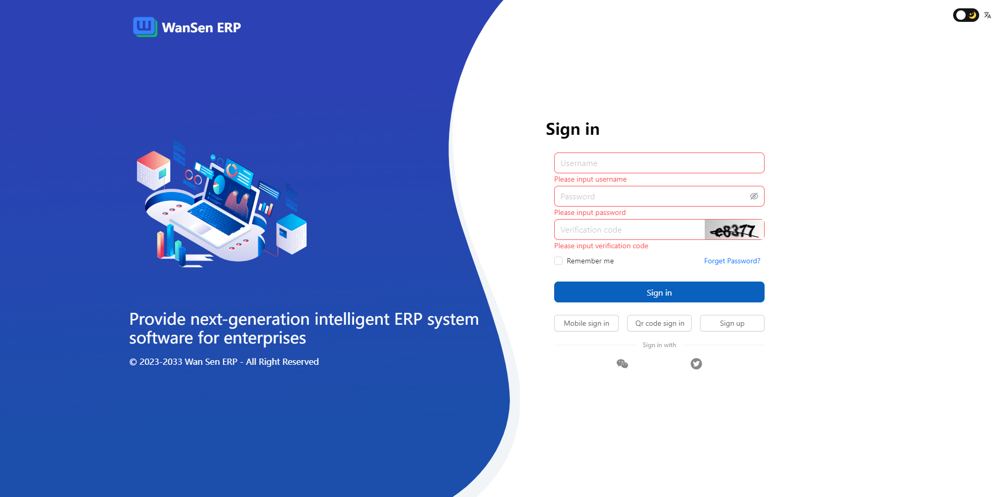
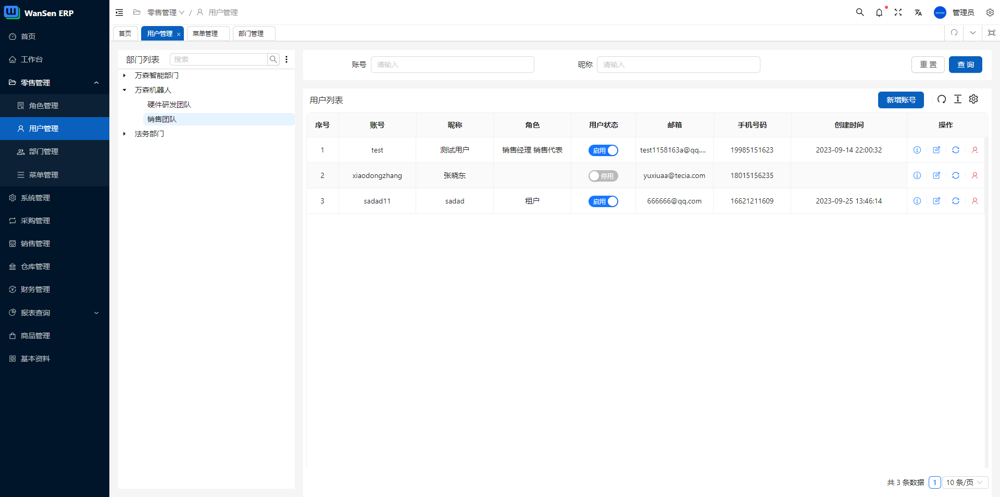

<h1 align="center"><a href="#" target="_blank">Enterprise AI Resource Planning</a></h1>
<div align="center">
 <strong>
  Next generation artificial intelligent ERP system
 </strong>
</div>
<br />

<div align="center">
  <!-- Crates version -->
  <a href="https://spring.io/projects/spring-boot#learn">
    
  </a>
  <a href="#">
    
  </a>
  <!-- commits -->
  <a href="#">
    
  </a>
</div>
<br />

On the basis of ERP business, we have expanded GPT-3.5. individually or company can fine tune your model through our system and deploy it through Docker or other methods. 

You can provide fully automated business form submission operations through your simple description, and you can chat, interact, and consult information with GPT.

**Note: This is a front-end and back-end separated project. This repository stores backend code, please browse [here](https://github.com/wansenai/wansenerpui) for the front-end repository.**

[Enginsh](https://github.com/wansenai/wansen-erp/blob/master/README.md) / [简体中文](https://github.com/wansenai/wansen-erp/blob/master/README_ZH.md)

## Online preview
- [eairp preview / 在线预览](https://erp.wansen.cloud/)
- test account (测试账号): wansen
- test password (测试密码): 123456

Some functional modules are being developed and improved, please refer to our [to-do list](https://github.com/wansenai/eairp-web/issues/41). It's not easy to generate electricity with love.
If this project is helpful to you, please click on Star. Thank you.

## Other Repository
- [eairp-web](https://github.com/wansenai/eairp-web)
- [eairp-app](https://github.com/wansenai/eairp-app) Note: (App is currently in the development stag)

## Quick Start
You need to first install the Docker environment and already have the Redis and MySQL8.0 environments

### Pull images
```shell
docker pull wansenai/eairp:latest
```
### Run Server
You can customize and modify port 8080, please ensure that the service ports monitored by your front-end are consistent
```shell
docker run --name eairp -d -p 8080:8088 wansenai/eairp:latest 
```
At present, we are preparing to package all the environments into a `docker-compose`, and this plan may need to be postponed later

## System screenshot (only part)





## License

Licensed under either of

- Apache License, Version 2.0, ([LICENSE-APACHE](LICENSE-APACHE) or https://opensource.wansenai.com/)
- MIT license ([LICENSE-MIT](LICENSE-MIT) or https://opensource.wansenai.com/mit)

at your option.

## Community
WeChat Group: 关注微信公众号**万森工业技术**点击开源交流按钮扫码进群，欢迎进群交流
(由于微信的群规则，每周会更新一次二维码链接推送)

## Contribution
We welcome every contributor, both in terms of code and documentation.

Unless you explicitly state otherwise, any contribution intentionally submitted for inclusion in the
work by you, as defined in the Apache-2.0 license, shall be dual licensed as above, without any
additional terms or conditions.
