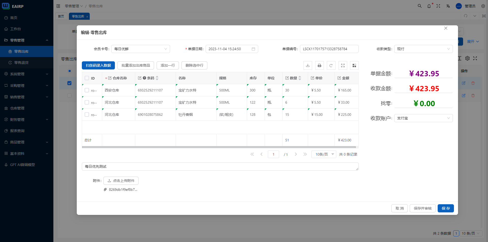
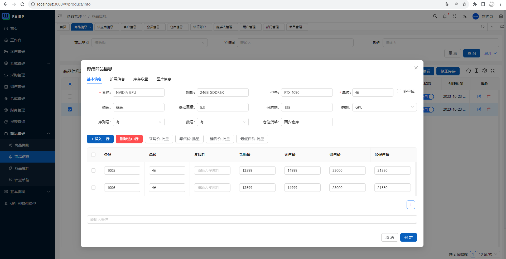
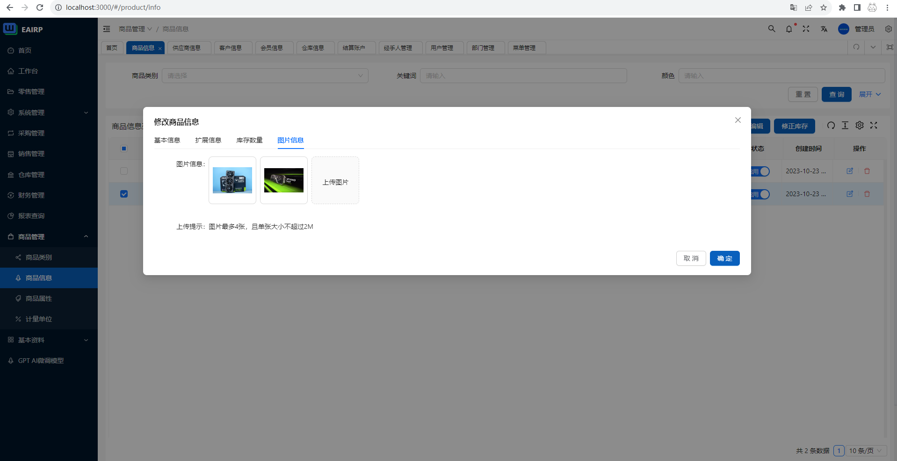
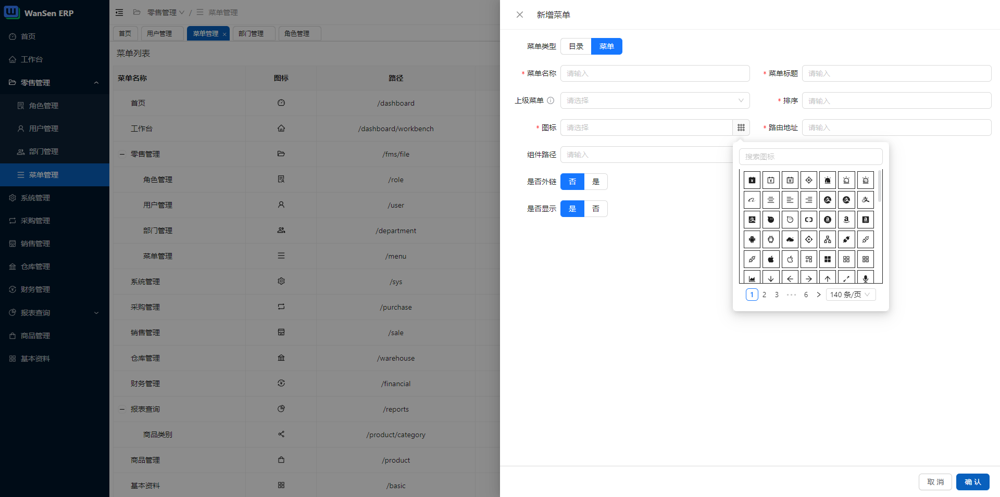
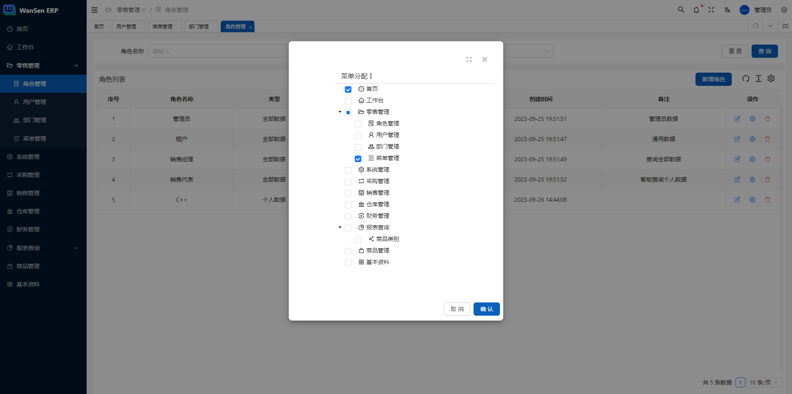

<h1 align="center"><a href="#" target="_blank">企业资源计划系统</a></h1>
<div align="center">
 <strong>
  下一代智能ERP系统
 </strong>
</div>
<br />

<div align="center">
  <!-- Crates version -->
  <a href="https://spring.io/projects/spring-boot#learn">
    
  </a>
 <a href="https://codecov.io/gh/wansenai/eairp" > 
     
 </a>
  <a href="#">
    
  </a>
  <!-- commits -->
  <a href="#">
    
  </a>
   <a href="">
    
  </a>
</div>
<br />

在ERP业务的基础上，我们扩展了GPT-3.5。个人或公司可以通过我们的系统对您的模型进行微调。
您可以通过简单的描述提供完全自动化的业务表单提交操作，还可以与GPT聊天、交互和查阅信息。
您可以通过Docker进行部署，以快速启动和使用。

它是完全免费的，如果这个项目对你有帮助，请点击Star。非常感谢。

## Project
[Enginsh](https://github.com/wansenai/eairp/blob/master/README.md) / [简体中文](https://github.com/wansenai/eairp/blob/master/README_ZH.md)

## Online preview
- [eairp preview / 在线预览](https://erp.wansen.cloud/)
- 测试账号: wansen
- 测试密码: 123456

一些功能模块正在开发和改进中，请参阅我们的待办事项列表[开发清单](https://github.com/wansenai/eairp/issues/124)。

## 快速开始
```shell
docker pull wansenai/eairp:2.1.1

docker pull wansenai/eairp-web:2.1.1
```
## 运行服务
您可以自定义和修改端口8080，请确保您的前端监控的服务端口一致。
如果要部署到您的域名，则需要将本地主机修改为您的域名。

我们将使用Docker Compose方法进行集成和部署，下一步它很快就会到来：）

```shell
docker run --name eairp -d -p 8080:8088 wansenai/eairp:2.1.1

docker run --name eairp-web -d -p 3000:80 -e API_BASE_URL=http://localhost:8080/erp-api wansenai/eairp-web:2.1.1
```

## 系统展示图








## 其他项目
- [eairp-app](https://github.com/wansenai/eairp-app)  **注意:** (该应用程序当前需要等待web端完全开发后才能继续)

## License

根据以下任一许可证之一，对本项目中的代码和文档进行许可：

- Apache License, Version 2.0, ([LICENSE-APACHE](LICENSE-APACHE) or https://opensource.wansenai.com/)
- MIT license ([LICENSE-MIT](LICENSE-MIT) or https://opensource.wansenai.com/mit)

根据您的选择。

## 社区
微信群: 请添加微信`wansenai`备注ERP开源.

## 贡献
我们欢迎每一位贡献者，无论是在代码还是文档方面。

除非您另有明确说明，否则有意提交以纳入 根据Apache-2.0许可证的定义，您的作品应具有上述双重许可，没有任何附加条款或条件。
